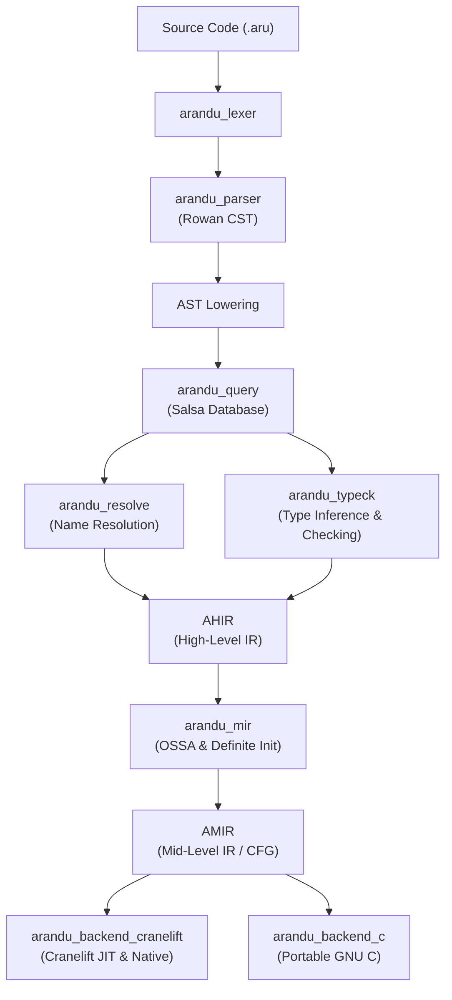

# Arandu

<p align="center">
  <strong>A safe, fast, and ergonomic systems programming language.</strong>
</p>

<p align="center">
  <a href="https://github.com/arandu-lang/arandu/actions/workflows/release.yml"></a>
  <a href="https://github.com/arandu-lang/arandu/releases/latest"></a>
  <a href="https://arandu-lang.dev"></a>
  <a href="LICENSE-MIT"></a>
</p>

<p align="center">
  <a href="https://arandu-lang.dev">Website</a> •
  <a href="#overview">Overview</a> •
  <a href="#key-features">Key Features</a> •
  <a href="#a-quick-taste-of-arandu">A Quick Taste</a> •
  <a href="#quick-start">Quick Start</a> •
  <a href="#command-line-interface">CLI</a> •
  <a href="#compiler-architecture">Architecture</a> •
  <a href="#roadmap--rfcs">Roadmap & RFCs</a> •
  <a href="#contributing">Contributing</a>
</p>

---

## Overview

**Arandu** is a modern systems programming language engineered for developers who demand deterministic control over memory, execution, and machine code without sacrificing ergonomic syntax or understandable compiler diagnostics.

Arandu introduces a **hybrid memory safety model**: static linear ownership (`own`) and safe borrowing (`ref`), complemented by a thread-confined generational fallback runtime (**GenRef**). This architecture eliminates use-after-free, double-free, and dangling pointer vulnerabilities at compile time with dynamic verification guarantees — completely avoiding stop-the-world garbage collection pauses.

### Why Arandu?

- **Zero-Cost Safety Without a Garbage Collector**: Values have clear owners and borrowed references. Where lifetimes cannot be proven strictly at compile time, the generational fallback model provides safe, typed handles with deterministic cleanup.
- **Incremental by Design**: Built from the ground up on Rowan concrete syntax trees (CST) and Salsa tracked queries. Modifying a function body re-analyzes only the affected item, keeping IDE response times under 10ms.
- **Empathetic Developer Experience**: Compiler diagnostics (via Miette and LSP) explain *what* failed, *why* it failed with precise source labels, and *how* to resolve it, linked to documented explanation pages for every error code.
- **Dual Native Backends**: Fast JIT execution with Cranelift for instant feedback cycles (`arandu run`), native binary compilation (`arandu build`), and clean, portable GNU C emission (`arandu emit-c`).

---

## Key Features

| Pillar | Description |
| :--- | :--- |
| **Memory Safety Without GC** | Single-owner linear types (OSSA), borrowed references (`ref T`), and thread-confined generational references (**GenRef**). |
| **Incremental Salsa Queries** | CST-first incremental re-parsing and fine-grained Salsa caching preserve query early-cutoff across edits. |
| **Human-Centric Diagnostics** | Structured error codes (`LX*`, `P*`, `N*`, `T*`, `O*`, `W*`), secondary context labels, and suggested quick fixes. |
| **Dual Native Code Generation** | Instant JIT compilation and native object linking via Cranelift, plus portable GNU C99/C11 code generation. |
| **Batteries-Included Tooling** | Integrated package management (`arandu new`), dependency verification, code formatter (`arandu fmt`), and system doctor. |
| **First-Class Editor Support** | Full-featured Language Server Protocol (LSP) with type-aware semantic tokens, hover, completions, and code actions. |

---

## A Quick Taste of Arandu

Here is an example demonstrating structs, explicit ownership transfer, borrowing, and standard I/O:

```arandu
module app.main

import io

struct Message {
    text: str
    priority: int
}

// Borrowing: `msg` is lent temporarily; the caller retains ownership
func inspect(msg: ref Message): bool {
    return msg.priority > 0
}

// Ownership transfer: `msg` is consumed and freed by the callee
func send(msg: own Message) {
    io.println("Sending: ${msg.text} (priority: ${msg.priority})")
}

func main(): int {
    let msg = Message {
        text: "Hello from Arandu!",
        priority: 1,
    }

    if inspect(ref msg) {
        send(msg) // ownership transferred here
    }

    return 0
}
```

### Compiler Diagnostics in Action

When memory safety invariants or ownership rules are violated, the compiler provides clear and actionable feedback:

```text
error[O001]: use of moved value `msg`
  --> src/main.aru:25:17
   |
24 |         send(msg)
   |              --- value moved here
25 |         inspect(ref msg)
   |                 ^^^^^^^ value borrowed here after move
   |
   = note: `Message` is an owned type; passing it to `send(own Message)` moved ownership
   = help: borrow the value instead using `ref msg` or clone it before moving
```

---

## Quick Start

### Installation

Install the official Arandu SDK with a single command:

#### Linux & macOS
```bash
curl -sSf https://arandu-lang.dev/install | sh
```

#### Windows (PowerShell)
```powershell
irm https://arandu-lang.dev/install.ps1 | iex
```

Pre-compiled release binaries and cryptographic signatures (`SHA256SUMS`, `.blake3`, GitHub attestations) are available on [GitHub Releases](https://github.com/arandu-lang/arandu/releases).

### Create Your First Project

```bash
# 1. Initialize a new binary project
arandu new hello_arandu
cd hello_arandu

# 2. Run immediately via Cranelift JIT
arandu run

# 3. Type-check and validate without code generation
arandu check

# 4. Compile an optimized native executable
arandu build --release
```

---

## Command-Line Interface

The `arandu` CLI provides a unified toolchain for compiling, testing, and managing packages:

```text
The Arandu Programming Language Compiler

Usage:
  arandu <COMMAND> [OPTIONS] [PACKAGE-PATH | FILE]
  arandu [OPTIONS] <FILE.aru>

Build & Execution:
  run        Compile and execute a package or file via Cranelift JIT
  build      Compile package to native executable or library
  check      Type-check and validate without code generation
  test       Execute unit and integration test suites
  bench      Run benchmarks and compare baseline metrics

Project & Packaging:
  new        Create a new Arandu project directory
  init       Initialize an Arandu package in current directory
  watch      Watch filesystem and re-check package incrementally
  clean      Remove project build artifacts and scratch cache
  doc        Generate package documentation (html, md, json)

Dependencies & Verification:
  tree       Display canonical resolved dependency graph
  audit      Audit locked provenance and security policies
  vendor     Create verified offline source snapshot
  verify     Verify offline cache integrity against lockfile
  update     Review and update dependency locks (--accept)

Plumbing & Inspection:
  lex        Dump concrete syntax tokens
  parse      Dump concrete syntax tree (Rowan CST / AST)
  hir        Dump High-Level Intermediate Representation
  amir       Dump Arandu Mid-Level IR (SSA/OSSA)
  graph      Emit module dependency or control flow graph
  emit-c     Emit portable C source code
  fmt        Format source files according to style rules
  doctor     Inspect toolchain, environment, and stdlib paths
  cache      Inspect, prune, and verify compiler cache
  hash-file  Compute BLAKE3 checksum for packaging

Target & Toolchain Options:
  --release              Enable speed optimizations (Cranelift + AMIR O2)
  --stdlib-path <DIR>    Override path to standard library
  --cache-dir <DIR>      Override compiler cache directory
  --layout <MODEL>       Data layout model: host, ptr4, ptr8, i686 (default: host)
  --vcs <VCS>            VCS for new projects: auto, git, none (default: auto)
  -v, --verbose          Enable detailed progress and timing logs
  -V, --version          Print compiler version and exit
  -h, --help             Print this help message

Generational Memory Safety:
  --no-generational-fallback  Promote fallback warnings (O004) to compile-time errors
  --genref-report             Emit per-function GenRef check and allocation statistics

Developer & Debug Flags (-Z):
  -Ztime-passes          Measure and display pass execution timings
  -Zprofile-queries      Profile Salsa incremental semantic query costs
  -Zdump-mir             Dump intermediate AMIR between optimization passes
  -Zdebug-parser         Trace Rowan CST parsing steps
  -Zdebug-typeck         Trace bidirectional type inference & constraints
  -Zdebug-ossa           Trace ownership SSA generation and joins
  -Zdebug-all            Enable all compiler debug traces
```

---

## Compiler Architecture

Arandu is structured as an incremental, query-driven compilation pipeline:



### Workspace Structure

| Area | Crates | Responsibilities |
| :--- | :--- | :--- |
| **Frontend** | [`arandu_base`](crates/arandu_base)<br>[`arandu_lexer`](crates/arandu_lexer)<br>[`arandu_parser`](crates/arandu_parser)<br>[`arandu_diagnostics`](crates/arandu_diagnostics) | Lexer, Rowan CST-first parsing, token streams, diagnostic definitions (`DiagCode`), and Miette report rendering. |
| **Middle-end** | [`arandu_middle`](crates/arandu_middle)<br>[`arandu_resolve`](crates/arandu_resolve)<br>[`arandu_typeck`](crates/arandu_typeck)<br>[`arandu_mir`](crates/arandu_mir) | Name resolution, bidirectional type inference, generic monomorphization, OSSA, borrow checking, and AMIR optimizations. |
| **Incremental** | [`arandu_query`](crates/arandu_query) | Sole owner of Salsa database state, tracking query inputs, item-level hashes, and early-cutoff caching. |
| **Backends** | [`arandu_backend_cranelift`](crates/arandu_backend_cranelift)<br>[`arandu_backend_c`](crates/arandu_backend_c)<br>[`arandu_codegen`](crates/arandu_codegen)<br>[`arandu_runtime`](crates/arandu_runtime) | Cranelift JIT engine and native object emission, portable GNU C translation, and language runtime support. |
| **Tooling & IDE** | [`arandu_cli`](crates/arandu_cli)<br>[`arandu_lsp`](crates/arandu_lsp)<br>[`arandu_fmt`](crates/arandu_fmt)<br>[`arandu_doc`](crates/arandu_doc) | Compiler CLI, Language Server (`arandu-lsp`), pure CST formatter, and documentation extractor. |
| **Test & Infra** | [`arandu_test_support`](crates/arandu_test_support)<br>[`arandu_fuzz_support`](crates/arandu_fuzz_support)<br>[`xtask`](xtask) | Golden test runners, grammar fuzzing harness, release contract verification, and architecture invariants. |

---

## Editor & IDE Support

Official support for Visual Studio Code is provided in the [`editors/vscode`](editors/vscode) directory:

- **Syntax Highlighting**: TextMate grammar and Rowan CST-backed classification.
- **Language Server**: Backed by `arandu-lsp` with:
  - Type-aware semantic token highlighting
  - Hover documentation with rendered function signatures
  - Go to Definition and Find References across modules
  - Document & workspace symbol search
  - Diagnostic squiggles with quick-fix code actions
  - Formatting on save via `arandu_fmt`

---

## Building from Source

### Prerequisites

- **Rust toolchain**: Exactly Rust 1.97.1 (managed automatically via `rustup` and `rust-toolchain.toml`).
- **C Compiler**: GCC or Clang (required for linking native binaries and C backend verification).

### Build Commands

```bash
# Clone the repository
git clone https://github.com/arandu-lang/arandu.git
cd arandu

# Build the release compiler binary
cargo build --release --bin arandu

# The executable will be placed in target/release/arandu
./target/release/arandu --version
```

### Invariant Verification Suite

Every change to the compiler must satisfy the canonical validation suite:

```bash
cargo fmt --all -- --check
cargo check --workspace --locked
cargo clippy --workspace --all-targets --all-features --locked -- -D warnings
cargo test --workspace --locked
cargo run --locked -p xtask -- check-diag-docs
RUSTDOCFLAGS="-D warnings" cargo doc --workspace --no-deps --locked
cargo run --locked -p xtask -- check-architecture
cargo run --locked -p xtask -- check-line-endings
```

---

## Roadmap & RFCs

- **Master Compiler Roadmap**: [docs/arandu-compiler-roadmap-v0.1.md](docs/arandu-compiler-roadmap-v0.1.md) — The single authoritative execution queue.
- **RFC Catalog**: [docs/rfcs/](docs/rfcs/) — Formal architectural specifications (RFC 0000 through RFC 0010).
- **Diagnostic Catalog**: [docs/errors/](docs/errors/) — Detailed guides and solutions for every user-facing compiler diagnostic.
- **Documentation Hub**: [docs/README.md](docs/README.md) — Map of all technical specifications and architecture contracts.

---

## Contributing

We welcome contributions to Arandu! Please read our [CONTRIBUTING.md](CONTRIBUTING.md) guide and [AGENTS.md](AGENTS.md) for architectural invariants before submitting pull requests.

All discussions, bug reports, and feature proposals take place on [GitHub Issues](https://github.com/arandu-lang/arandu/issues) and [GitHub Discussions](https://github.com/arandu-lang/arandu/discussions).

---

## License

Arandu is dual-licensed under:

- **MIT License** ([LICENSE-MIT](LICENSE-MIT))
- **Apache License, Version 2.0** ([LICENSE-APACHE](LICENSE-APACHE))

You may choose either license at your option.
