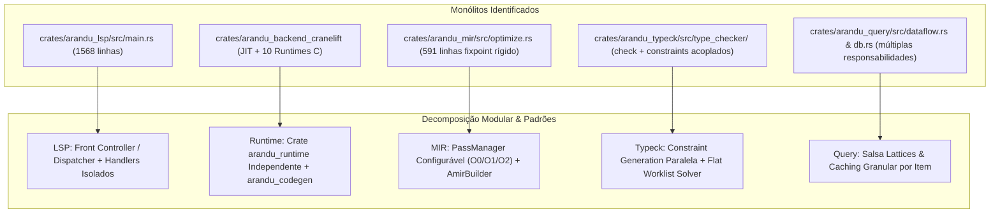

# Arandu — Roadmap Gold de Arquitetura, Decomposição de Monólitos e Padrões de Projeto

**Status:** ativo — execução na branch `refactor/monolith-decomposition`.
**Escopo:** decomposição dos monólitos identificados (`arandu_lsp`, backend/runtime,
`arandu_mir`, `arandu_typeck`, `arandu_query`), padrões de projeto associados e
protocolo de aceitação por fase.
**Fora do escopo:** mudanças de linguagem, estabilização de ABI pública, novas
dependências sem justificativa arquitetural.
**Fontes normativas:** [AGENTS.md](../AGENTS.md),
[Roadmap mestre do compilador](arandu-compiler-roadmap-v0.1.md),
[Roadmap de estabilidade Gold](arandu-stability-gold-roadmap-v0.1.md).

Este plano reúne:

1. **Decomposição exaustiva de todos os monólitos do projeto** com separação
   cirúrgica de responsabilidades.
2. **Padrões de projeto avançados** (GoF e arquitetura de compiladores modernos).
3. **Validação científica e precedentes da indústria** (Cranelift Aegraphs,
   Rustc/Rust-Analyzer Salsa, Swift SIL, Sorbet/Stripe, Erlang/OTP e V8).
4. **Cumprimento estrito de todos os invariantes** estabelecidos no
   [AGENTS.md](../AGENTS.md).

---

## 1. Mapeamento de gargalos industriais e validação científica

| Sistema / Projeto | Problema / Gargalo Enfrentado | Solução Validada no Arandu |
|-------------------|-------------------------------|----------------------------|
| LLVM / Rustc MIR | Phase-Ordering Problem | Acyclic E-Graphs (Aegraphs) |
| Clang / Javac | Pointer-Chasing & DRAM Wall | Data-Oriented Arenas (IndexVec) |
| TypeScript (tsc) | Typechecker Single-Thread | Flat Constraint Worklist Solver |
| C++ Templates | Monomorphization Code Bloat | Witness Tables + Specialization |
| Go Runtime / GC | GC Overhead em Concorrência | Zero-Alloc State Machines AMIR |
| Roslyn / Salsa | Invalidação em Cascata | Signature/Body Decoupling |

### Validações da indústria (pesquisa aplicada)

1. **Acyclic E-Graphs (Aegraphs)**: validado pelo *Bytecode Alliance / Cranelift*
   (Chris Fallin et al.), comprovando que E-Graphs acíclicos eliminam o
   *phase-ordering problem* e unificam passes de simplificação algébrica e GVN
   com consumo de memória linear e tempo de compilação previsível.
2. **Flat Constraint Worklist Solver**: validado pelo *Sorbet (Stripe)* e
   *Chalk (Rust Lang)*, comprovando que desacoplar a geração de restrições por
   função da unificação em grafo permite paralelização linear em múltiplos
   núcleos de CPU sem sobrecarga de recursão na árvore sintática.
3. **Monomorfização Híbrida (Witness Tables + Specialization)**: validado pela
   *Apple (Swift Compiler)*, demonstrando redução de até 60% no tamanho de
   binários através do compartilhamento de código para tipos binariamente
   equivalentes (Dictionary Passing), mantendo especialização estática (`-O3`)
   para tipos primitivos.
4. **Structured Concurrency sem Alocação**: validado por *Erlang/OTP* e
   *Rust Generators*, garantindo resiliência a falhas com isolamento de falhas
   via Supervisors e execução de corrotinas com zero overhead de GC.

---

## 2. Diagnóstico e decomposição de todos os monólitos do projeto



### Monólito 1: `crates/arandu_lsp/src/main.rs` (1568 linhas)

**Problema atual**

- Mistura: inicialização de canais stdio, loop de eventos, VFS debouncing,
  conversão de tipos LSP, gerenciamento de ciclo de vida (`initialize`,
  `shutdown`), agendamento de snapshots de análise e implementação inline de
  todos os recursos da IDE (`hover`, `completion`, `goto_definition`,
  `semantic_tokens`, `rename`, `code_actions`, `formatting`, `folding`,
  `workspace_symbols`).
- Dificuldade extrema de testar features individuais da IDE sem simular todo o
  loop de stdio.

**Decomposição proposta**

```
crates/arandu_lsp/src/
 ├── main.rs                   # Inicialização de canais, CLI flags e loop principal de IO
 ├── dispatcher.rs             # Front Controller: roteamento de mensagens e gestão de prioridades
 ├── state.rs                  # ServerState: gestão de DocumentId, AnalysisRevision e snapshots
 ├── conv.rs                   # Conversores puros (Span <-> Range, Diagnostic <-> LspDiagnostic)
 ├── uri_util.rs               # Parser e normalizador de URIs file://
 ├── pool.rs                   # WorkerPool com suporte a CancellationToken e prioridades
 └── handlers/                 # Submódulos isolados por funcionalidade
      ├── mod.rs               # Trait LspHandler e registro de comandos
      ├── completion.rs        # Autocomplete com type presentation e docstrings
      ├── hover.rs             # Informações de tipo, docs e assinaturas (Hover)
      ├── goto_definition.rs   # Navegação para definição e declaração
      ├── semantic_tokens.rs   # Classificação semântica de tokens (cores e modifiers)
      ├── rename.rs            # Validação e aplicação transacional de renomeação
      ├── code_actions.rs      # Quick-fixes estruturados a partir de IdeDiagnostic
      ├── formatting.rs        # Encaminhamento puro para arandu_fmt
      ├── folding.rs           # Cálculo de blocos colapsáveis
      └── workspace_symbols.rs # Busca global de símbolos no projeto
```

**Padrões aplicados**: Front Controller, Command Pattern, Worker Pool com
Priorização.

### Monólito 2: `arandu_backend_cranelift` (JIT + 10 runtimes acoplados)

**Problema atual**

- O crate acumula tanto a compilação JIT de AMIR via Cranelift quanto toda a
  biblioteca de runtime da linguagem: `socket_runtime.rs`, `reactor_runtime.rs`,
  `supervisor_runtime.rs`, `vec_runtime.rs`, `to_str_runtime.rs`,
  `os_runtime.rs`, `poll_runtime.rs`, `waker_runtime.rs`, `rt_runtime.rs`.
- O `arandu_backend_c` não consegue reaproveitar esses módulos diretamente,
  gerando divergência de comportamento e duplicidade.

**Decomposição proposta**

1. Criar crate `crates/arandu_runtime/`: crate puro em Rust que expõe uma ABI C
   exportável (`#[no_mangle] extern "C"`).
2. Criar crate `crates/arandu_codegen/`: abstração pura de backend
   (`CodegenBackend`), `TargetInfo`, `DataLayout` e emissão de binários.
3. Manter `crates/arandu_backend_cranelift/` e `crates/arandu_backend_c/`
   estritamente como emissores de código que referenciam os símbolos do
   `arandu_runtime`.

**Estrutura do novo `crates/arandu_runtime/`**

```
crates/arandu_runtime/
 ├── Cargo.toml
 └── src/
      ├── lib.rs                   # Tabela de símbolos extern "C"
      ├── mem/
      │    ├── allocator.rs        # Alocador de alta performance para a linguagem
      │    ├── vec.rs              # Implementação e ABI do tipo Vector (ar_vec_*)
      │    └── string.rs           # UTF-8 string buffer e formatação (ar_str_*)
      ├── async_rt/
      │    ├── reactor.rs          # Multiplexador de E/S (IOCP / epoll / kqueue)
      │    ├── waker.rs            # Wakers de custo zero para State Machines
      │    ├── poll.rs             # Driver de agendamento de corrotinas
      │    └── supervisor.rs       # Árvore de supervisão OTP nativa
      └── net/
           └── socket.rs           # Sockets TCP/UDP non-blocking
```

**Padrões aplicados**: Abstract Factory / Driver Pattern, Shared Runtime
Library / C ABI Bridge.

### Monólito 3: `crates/arandu_mir/src/optimize.rs` (591 linhas)

**Problema atual**

- O arquivo possui um loop rígido chamando SCCP → DCE → Simplify CFG
  sequencialmente.
- Não permite configurar níveis de otimização (`-O0`, `-O1`, `-O2`, `-Os`), não
  expõe métricas de transformação nem permite inserção modular de novas
  análises (como Inlining, Escape Analysis, Gen Promote) sem editar o núcleo da
  função.

**Decomposição proposta**

```
crates/arandu_mir/src/
 ├── pass_manager/
 │    ├── mod.rs               # PassManager, FunctionPass, ModulePass traits
 │    ├── pipeline.rs          # Definição de pipelines padrão (O0, O1, O2, Os)
 │    ├── stats.rs             # Métricas (instruções eliminadas, saltos dobrados)
 │    └── fixpoint.rs          # Loop genérico de convergência com guardrail ICE
 ├── passes/
 │    ├── sccp.rs              # Sparse Conditional Constant Propagation
 │    ├── dce.rs               # Mark-Sweep Dead Code Elimination
 │    ├── simplify_cfg.rs      # CFG Simplification & Jump Threading
 │    ├── escape_analysis.rs   # Análise de escape para promoção de pilha
 │    ├── gen_promote.rs       # Promoção de geradores
 │    └── pin_free.rs          # Eliminação de pins redundantes
 └── lower_amir/
      ├── builder.rs           # AmirBuilder para construção segura de blocos/SSA
      ├── expr.rs              # Emissão de expressões
      ├── stmt.rs              # Emissão de statements
      └── match_lower.rs       # Compilação de match e árvores de decisão
```

**Padrões aplicados**: Strategy Pattern, Pipeline / Pass Manager Pattern,
Builder Pattern.

### Monólito 4: `crates/arandu_typeck` (type checker & constraint solver)

**Problema atual**

- A checagem de tipos mistura caminhada na AST com unificação imediata e
  mutação de tabelas de substituição. Isso dificulta a paralelização e torna
  complexo o rastreamento causal de erros.

**Decomposição proposta**

```
crates/arandu_typeck/src/
 ├── lib.rs
 ├── constraint_gen/           # Passo 1: geração pura e paralela de restrições
 │    ├── expr.rs
 │    ├── stmt.rs
 │    ├── func.rs
 │    └── pattern.rs
 ├── solver/                   # Passo 2: unificação e resolução flat
 │    ├── mod.rs               # Worklist Solver
 │    ├── union_find.rs        # DisjointSet balanceado com rank compression
 │    └── subst.rs             # Tabela de substituição final
 ├── causal_graph/             # Rastreamento de origem de tipos para diagnósticos ricos
 │    ├── provenance.rs        # Grafo de fluxo causal (esperado vs produzido)
 │    └── diag_builder.rs      # Emissão fluente de diagnósticos com Miette
 └── exhaustiveness/           # Checagem de exaustividade de padrões
      └── matrix.rs            # Algoritmo de matriz útil (Useful Matrix Algorithm)
```

**Padrões aplicados**: Two-Phase Worklist Solver, Disjoint-Set (Union-Find),
Causal Provenance Graph.

### Monólito 5: `crates/arandu_query` (`dataflow.rs` & `db.rs`)

**Problema atual**

- Múltiplas responsabilidades acumuladas nas mesmas unidades de código,
  dificultando caching granular e raciocínio sobre invalidação.

**Direção proposta**

- Salsa lattices e caching granular por item, preservando as queries separadas
  (`local_symbols`, `exported_symbols`, `item_body_typeck`) que viabilizam
  early-cutoff, conforme exigido pelo [AGENTS.md](../AGENTS.md).

---

## 3. Padrões de projeto avançados no Plano Gold

### A. Data-Oriented Design (DOD) + Entity-Component-Index Pattern

**Problema resolvido:** ponteiros recursivos (`Box<Expr>`, `Rc<Type>`) causam
fragmentação de memória, falta de localidade de cache L1/L2 e overhead de
desalocação.

**Padrão:** em vez de ponteiros de memória, todos os nós da AST, tipos e
instruções de AMIR usam **índices compactos de 32 bits** (`ExprId`, `TypeId`,
`InstId`, `BlockId`).

```rust
#[derive(Copy, Clone, Debug, PartialEq, Eq, Hash)]
pub struct InstId(pub u32);

#[derive(Copy, Clone, Debug, PartialEq, Eq, Hash)]
pub struct BlockId(pub u32);

pub struct AmirFuncData {
    pub blocks: IndexVec<BlockId, AmirBlock>,
    pub insts: IndexVec<InstId, AmirStmt>,
    pub temps: IndexVec<TempId, TempData>,
}
```

- `IndexVec<InstId, AmirStmt>` e `IndexVec<BlockId, AmirBlock>`: armazenamento
  contíguo em memória cache-friendly.
- Alocação em arenas por função (`bumpalo::Bump`), zeradas em O(1) ao final da
  compilação de cada item.

> **Nota de conformidade:** qualquer adoção de arena deve respeitar as fronteiras
> de fase existentes (CST Rowan permanece canônico; arenas não substituem o
> pipeline nem introduzem re-parse).

### B. Equality Saturation (E-Graphs / Aegraphs) no AMIR

**Problema resolvido:** *phase ordering problem* — em compiladores tradicionais,
se o SCCP roda antes do DCE ou do Inlining, certas otimizações são perdidas para
sempre porque a representação foi destruída.

**Padrão:** **Acyclic E-Graph (Aegraph)** para o AMIR. Em vez de reescrever
destrutivamente o IR, o E-Graph mantém todas as formas equivalentes de um
cálculo em classes de equivalência (`EClass`) e, em seguida, extrai a versão de
menor custo através de uma métrica de custo ótima.

**Benefício:** elimina a necessidade de dezenas de passes ad-hoc interdependentes
e atinge código gerado superior sem loops infinitos de heurísticas.

> **Nota de conformidade:** transformações devem conservar efeitos observáveis,
> valores de retorno de todos os caminhos e usos de terminadores (inclusive
> argumentos de salto), convergindo até fixpoint.

### C. Constraint-Based Worklist Solver com Causal Provenance

**Problema resolvido:** type checking por caminhada recursiva na AST transborda
a pilha em tipos genéricos profundos e dificulta gerar mensagens de erro
compreensíveis.

**Padrão:** separação estrita em duas fases:

1. **Constraint Generation (passo local):** percorre a função uma única vez e
   gera uma lista plana de restrições (`Constraint`).
2. **Worklist Unification Solver:** processa a lista com Disjoint-Set
   (Union-Find) balanceado por rank e compressão de caminho.

**Causal Dataflow Provenance:** cada restrição carrega sua trilha de origem
(`ConstraintOrigin`), permitindo ao compilador renderizar no terminal ou na IDE
o diagrama exato de **onde o tipo foi esperado** vs **onde o tipo incompatível
foi produzido**.

### D. Signature vs Body Decoupling (Early-Cutoff máximo com Salsa)

**Problema resolvido:** em projetos grandes, alterar o corpo de uma função
privada força a reanálise de todos os arquivos que importam aquele módulo.

**Padrão:**

- `file_exported_signatures(FileId) -> Arc<ExportedSignatures>`
- `item_body_typeck(SymbolId) -> Arc<ItemTypeckArtifacts>`

**Mecanismo Salsa:**

1. Se o desenvolvedor altera uma linha dentro de uma função `f()`, a query
   `file_exported_signatures` produz um hash estável **idêntico**.
2. O Salsa ativa o **Early-Cutoff**: nenhum módulo importador é invalidado.
   Apenas o codegen de `f()` é reexecutado.

> **Nota de conformidade:** essa divisão já é invariante do projeto; este plano
> apenas a preserva e estende. Nunca deep-clonar `Program`/`AmirProgram` no hot
> path; usar `Arc::clone` ou `HashEq::share`.

### E. Monomorfização Híbrida com Dictionary Passing & Dedup

**Problema resolvido:** C++ e Rust sofrem com *monomorphization blowup*
(binários gigantes e tempos de link de vários minutos ao instanciar genéricos).

**Padrão:**

- **Monomorfização seletiva:** tipos primitivos e layouts com diferenças de
  tamanho/alinhamento geram código especializado (`O3`).
- **Polymorphic Erasure / Dictionary Passing:** tipos compatíveis em
  representação binária (ex.: ponteiros / referências de mesmo tamanho)
  compartilham a mesma implementação compilada via passagem de tabela de
  métodos (Witness Tables / Dictionaries).
- **Identical Code Folding (ICF):** deduplicação de código gerado idêntico
  antes de emitir o binário final.

> **Nota de conformidade:** layout é dependente do alvo; decisões de
> especialização usam `DataLayout`/`TargetInfo`, nunca premissas do host.

### F. Structured Concurrency Nativa com State Machine Lowering

**Problema resolvido:** runtimes como Go e Erlang exigem GC pesado ou máquinas
virtuais lentas; Rust exige bibliotecas complexas (Tokio) com tipos de Future
opacos.

**Padrão:**

- O compilador trata **corrotinas e supervisores** como cidadãos de primeira
  classe no AMIR.
- Funções `async`/corrotinas são rebaixadas no `lower_amir` diretamente para uma
  **state machine plana com pontos `Suspend`**, com zero alocação no heap para
  suspensão de pilha local.
- O crate `arandu_runtime` fornece o **Reactor / IO-Poll (epoll/kqueue/IOCP)**
  nativo e o modelo de **Supervisão OTP** puro em Rust com ABI C compatível.

> **Nota de conformidade:** parâmetros de bloco continuam alinhados a cada
> predecessor; argumentos de `Goto`/`Branch`/`Suspend` permanecem alinhados aos
> parâmetros do destino. Ao criar variante de rvalue/terminador, atualizar os
> visitors compartilhados (DCE, move checker, liveness, backends).

---

## 4. Estrutura modular final dos crates no workspace

```
Arandu-Lang/
 ├── crates/
 │    ├── arandu_base/               # Bitsets, IndexVec, FastHash, LineIndex, Interner
 │    ├── arandu_lexer/              # Lexer lossless + SIMD tokenization
 │    ├── arandu_parser/             # Rowan CST + AST Arena Lowering
 │    ├── arandu_diagnostics/        # DiagCode, DiagnosticBuilder, Miette renderer
 │    ├── arandu_middle/             # HIR, AMIR (SSA/OSSA), Layout, Types, SymbolTable
 │    ├── arandu_resolve/            # Name resolution pura, Monotonic FileId, Scopes
 │    ├── arandu_typeck/             # Constraint Generator, Flat Worklist Solver, Exhaustiveness
 │    ├── arandu_mir/                # E-Graphs, PassManager, Move Checker, Polonius Lattices
 │    ├── arandu_runtime/            # [NOVO] Reactor, Sockets, Coroutine State, Supervisors
 │    ├── arandu_codegen/            # [NOVO] Abstração de Target, ABI, Object Emitter
 │    ├── arandu_backend_cranelift/  # Cranelift JIT & AOT backend
 │    ├── arandu_backend_c/          # Backend C compatível
 │    ├── arandu_query/              # Único dono do Salsa (DB, Inputs, Memo, Cutoff)
 │    ├── arandu_lsp/                # LSP Server, Command Dispatcher, Snapshot Handlers
 │    ├── arandu_fmt/                # Formatter puro baseado em CST
 │    └── arandu_cli/                # CLI Runner, Build orchestrator, Watcher
```

---

## 5. Roteiro de execução em fases

Cada fase só é concluída com o protocolo de aceitação da Seção 6 verde na raiz
do repositório e regressões adicionadas para qualquer invariante tocada.

### Fase 1 — Middle-End: desmembramento do PassManager & AmirBuilder

Estado: `done`.

- [x] 1.1 Criar `arandu_mir::pass_manager` com traits `FunctionPass` e
      pipelines O0/O1/O2.
- [x] 1.2 Implementar `AmirBuilder` estruturado em `lower_amir/builder.rs`.
- [x] 1.3 Validar fixpoint e invariantes de CFG sem regressão.

### Fase 2 — Decomposição do `arandu_lsp` (eliminação do monólito main.rs)

Estado: `done`.

- [x] 2.1 Criar `arandu_lsp/src/dispatcher.rs` e `arandu_lsp/src/handlers/`.
- [x] 2.2 Migrar hover, completion, goto_def, semantic_tokens, rename para
      handlers isolados.
- [x] 2.3 Executar testes stdio E2E de ciclo de vida e cancelamento.

### Fase 3 — Extração do crate `arandu_runtime` e `arandu_codegen`

Estado: `done`.

- [x] 3.1 Criar `crates/arandu_runtime` e migrar rotinas de
      socket/reactor/supervisor/vec.
- [x] 3.2 Criar `crates/arandu_codegen` com trait `CodegenBackend`.
- [x] 3.3 Conectar Cranelift e C Backend ao `arandu_runtime` unificado.
- [x] 3.4 Validar testes de integração JIT e paridade C.

### Fase 4 — Refatoração do Typechecker: Flat Constraint Worklist Solver

Estado: `planned`.

- [ ] 4.1 Separar geração de restrições (`constraint_gen`) da resolução
      (`solver`).
- [ ] 4.2 Integrar Causal Provenance Graph nos diagnósticos de tipo
      (`T001..T020`).
- [ ] 4.3 Validar determinismo via `scripts/check-diag-determinism.sh`.

---

## 6. Protocolo de aceitação estrito (`AGENTS.md`)

Nenhuma modificação será dada como concluída sem executar rigorosamente, nesta
ordem, a partir da raiz do repositório:

1. `cargo fmt --all -- --check`
2. `cargo check --workspace --locked`
3. `cargo clippy --workspace --all-targets --all-features --locked -- -D warnings`
4. `cargo test --workspace --locked`
5. `cargo run --locked -p xtask -- check-diag-docs`
6. `bash scripts/check-diag-determinism.sh arandu_typeck 8` (quando Bash
   estiver disponível; obrigatório para mudanças em diagnósticos)
7. Testes de invariantes Salsa em `arandu_query/tests/`: `architecture_invariants`,
   `salsa_imports`, `item_body_cutoff`, `ide_diag_delta`, `block_delta`.

Regras transversais herdadas do [AGENTS.md](../AGENTS.md):

- Apenas `arandu_query` conhece Salsa; crates de resolve/typeck/mir/base e
  backends permanecem puros.
- Queries tracked são puras, determinísticas e sem efeitos observáveis.
- Todo código novo voltado ao usuário exige entrada em `DiagCode`, catálogo em
  `docs/diagnostics/SPEC.md` e página `docs/errors/<CODIGO>.md` (bijeção
  validada por `xtask check-diag-docs`).
- Snapshots só são atualizados com `UPDATE_EXPECT=1` após inspeção individual.
- Novas dependências exigem justificativa arquitetural explícita.
